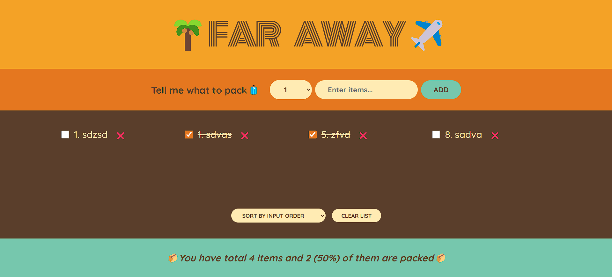

# 🧳 Far Away App

A simple React app to manage a travel packing list. Add items with quantity, mark them as packed, delete them, or clear the list completely. Track your packing progress with real-time stats.

---

## ⚙️ Features

- ➕ Add new items with quantity and description
- ✅ Toggle packed/unpacked status
- ❌ Delete individual items
- 🧹 Clear the entire list (with confirmation)
- 📊 View packing stats (total vs packed)

---

## 🛠 Tech Stack

- React (Functional Components + useState)
- CSS for styling

---

## 📂 Folder Structure

```
src/
├── App.js           # Main component
├── App.css          # Global styles
└── assets/
    ├── Form.js        # Form to add items
    ├── Items.js       # Single item component
    ├── Logo.js        # App logo component
    ├── PackingList.js # Displays the list of items
    └── Stats.js       # Shows packing statistics
```

---

## 📸 Preview



> Example UI of the app in action

---

## ▶️ Getting Started

1. Clone the repository:
   ```bash
   git clone https://github.com/Dipan46/far-away-app.git
   ```

2. Navigate to the project folder:
   ```bash
   cd far-away-app
   ```

3. Install dependencies:
   ```bash
   npm install
   ```

4. Start the development server:
   ```bash
   npm run dev
   ```

---

## ✍️ Notes

Uncomment the `initialItems` array in `App.js` to load sample data for testing.

---

## 🧑‍💻 Author

Made with ❤️ by [Dipan46](https://github.com/Dipan46)

## 📄 License

This project is open-source and available under the [MIT License](LICENSE).
